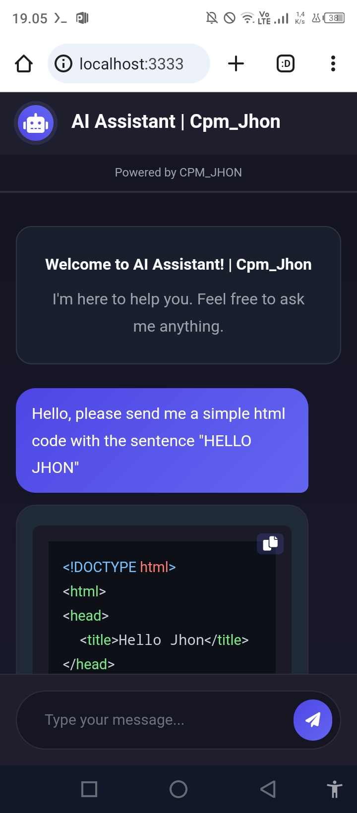

# AI Assistant




AI Assistant is a simple tool that allows you to interact with **AI Assistant** locally via a chatbot interface hosted on your machine. The tool provides a web-based interface to communicate with AI Assistant, enabling you to generate text content in real time. It is designed to run on a local server and can be accessed through your browser.

### Features

- **AI Assistant Access**: Interact with AI Assistant and generate content directly from your browser.
- **Simple Setup**: Install and run the server locally with minimal configuration.
- **Chatbot Interface**: A simple and intuitive user interface to interact with the AI.
- **Responsive**: Works seamlessly on both desktop and mobile devices.

---

## How to Install and Use AI Assistant

### https://replit.com

visit the replit website When you have logged in, create your Replit account when you have created it, press the button like the three dots in the top left corner car whose name is Create App After finishing, press exit to select the free option whether you want to use a template or via GitHub.  commands:

```opsi template replit 
Node.js
```

With Github:

```opsi github 
choose Froms URL
https://github.com/CpmJhon21/gemini-server-web-replit.git
```

### Installation

1. **Clone the repository** to your local machine:

    ```After entering this project in Replit, look for the shell look in the bottom right corner finished searching shell ```

2. **Install dependencies**:


    **Install Node.js and NPM (if not already there)**
    ```
    node -v
    npm -v
    ```
    
    **If Node.js is not installed, run:**
   ```bash
    curl -fsSL https://deb.nodesource.com/setup_18.x | bash - apt-get install -y nodejs
    ```
    
    **Inisialisasi Proyek NPM**
    
    ```bash
    npm init -y
    ```
    
    **Install Required Dependencies**
    
    ```bash
     npm install express
     npm install node-fetch@2 
    ```

3. **Install dependencies Automatic**:

    ```or if you want something simpler, you can run this code in shell ```

    ```bash
    install.sh
    ```
    
4. **Start the server**:

    ```bash
    node server.js
    ```
    
5. **Enter API Key (If Requested)**:
    
    **If you don't have an API Key, enter the API Key from)**

    ```bash
    https://aistudio.google.com/app/apikey
    ```

6. **If successful, the following output will appear:** 

 ```bash
   Server is running at:  `http://0.0.0.0:3000` in your browser.
   ```
   
7. **Website Access**:


   **Open your browser and access:**
    ```php-template
    https://<username>-<project>.repl.co
    ```
    
    **If Replit does not display the automatic link, try accessing:**
    
     ```ccp
    http://0.0.0.0:3000
    ```
    
    **or you can use this**
    
     ```arduino
    http://localhost:3000
    ```
    
    
    **After following the steps above, the server should be running fine on Replit.**
    

### API Key Configuration

The first time you run the server, it will prompt you to enter your Gemini API Key. You can obtain the API key from [Google AI Studio](https://aistudio.google.com/app/apikey). Follow the instructions to generate a new API key and enter it in the terminal when prompted.

The key will be saved locally, so you won’t need to re-enter it the next time you run the server.

### Usage

Once the server is running, you can interact with AI Assistant via the **chatbot** interface on your browser. Type your prompt in the input box, and the AI will generate content in response.

### Troubleshooting

- If you encounter issues with API Key configuration, ensure that you have entered a valid key. If the key is missing or invalid, the tool will prompt you to enter a new one.
- Ensure that your local server is running on `http://localhost:3000`. If it is not, check for errors in the terminal and ensure all dependencies are installed correctly.

---

## License

This project is open source and available under the [MIT License](LICENSE).
